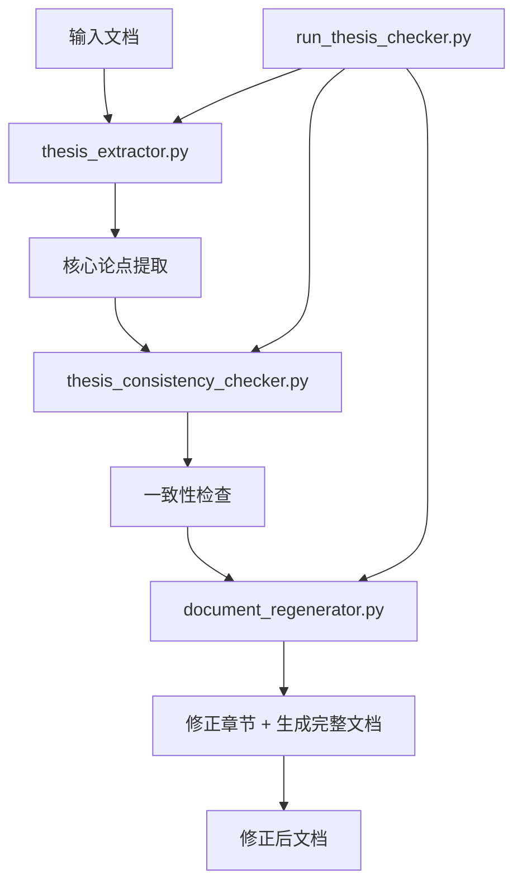

# 论点一致性检查 Agent

这是一个专门用于**论文论点一致性检查和修正**的智能代理系统，扮演"逻辑警察"的角色，确保全文围绕核心论点，无自相矛盾之处。

## 🎯 核心功能

### 第一步：提炼主旨
- **核心论点提取**：Agent 通读全文或核心章节，总结出全文的核心论点（Thesis Statement）
- **论证结构分析**：提取支撑论据、关键概念、研究目标等要素

### 第二步：逐一校对
- **一致性检查**：Agent 带着核心论点，逐一检查每个章节、每个段落的分论点是否服务于、或至少不违背核心论点
- **问题识别**：识别直接矛盾、偏离主题、论证薄弱、表述不清等问题
- **严重程度评级**：按照高、中、低三个级别对问题进行分类

### 第三步：智能修正
- **自动修正**：根据一致性检查结果，重新生成或修正有问题的章节
- **保持结构**：确保文档结构完全不变，只修正内容
- **质量保证**：生成专业、逻辑清晰的修正内容

## 🏗️ 系统架构（简化的3步流程）



## 📁 文件结构

### 核心模块
- **`thesis_extractor.py`** - 核心论点提取器
- **`thesis_consistency_checker.py`** - 论点一致性检查器  
- **`document_regenerator.py`** - 文档重新生成器（修正章节 + 生成完整文档）

### 运行脚本
- **`run_thesis_checker.py`** - 主运行脚本，提供完整的3步流水线

### 原有文件（已改造）
- **`document_reviewer.py`** - 原冗余检查器（保留）
- **`regenerate_sections.py`** - 原章节重生成器（保留）
- **`update_json_content.py`** - 原更新工具（保留）

## ⚙️ 环境配置

### 配置文件设置

1. **复制环境配置模板**：
   ```bash
   cp env_template.txt .env
   ```

2. **编辑配置文件**：
   ```bash
   # 编辑 .env 文件，至少需要设置以下必需配置：
   OPENROUTER_API_KEY=your-actual-api-key-here
   ```

3. **验证配置**：
   ```bash
   python config.py
   ```

### 主要配置项

| 配置项 | 说明 | 默认值 |
|--------|------|--------|
| `OPENROUTER_API_KEY` | OpenRouter API密钥（必需） | 内置默认密钥 |
| `OPENROUTER_MODEL` | 使用的AI模型 | `deepseek/deepseek-chat-v3-0324` |
| `DEFAULT_OUTPUT_DIR` | 默认输出目录 | `./thesis_outputs` |
| `LOG_LEVEL` | 日志级别 | `INFO` |
| `DEFAULT_AUTO_CORRECT` | 是否默认自动修正 | `true` |
| `THESIS_EXTRACTION_TEMPERATURE` | 论点提取温度参数 | `0.1` |
| `CONSISTENCY_CHECK_TEMPERATURE` | 一致性检查温度参数 | `0.1` |
| `CONTENT_CORRECTION_TEMPERATURE` | 内容修正温度参数 | `0.2` |

## 🚀 使用方法

### 方法一：完整流水线（推荐）

```bash
# 基本使用
python run_thesis_checker.py document.md

# 指定输出目录和标题
python run_thesis_checker.py document.json --title "研究报告" --output ./results

# 只修正高严重度问题
python run_thesis_checker.py document.md --severity high

# 只检查不修正
python run_thesis_checker.py document.md --no-auto-correct
```

### 方法二：分步执行

#### 1. 提取核心论点
```python
from thesis_extractor import ThesisExtractor

extractor = ThesisExtractor()
thesis = extractor.extract_thesis_from_document(document_content, "文档标题")
extractor.save_thesis_statement(thesis, "文档标题", "thesis_output.json")
```

#### 2. 检查一致性
```python
from thesis_consistency_checker import ThesisConsistencyChecker

checker = ThesisConsistencyChecker()
analysis = checker.check_consistency(document_content, thesis, "文档标题")
checker.save_consistency_analysis(analysis, thesis, "文档标题", "consistency_output.json")
```

#### 3. 修正文档并生成完整结果
```python
from document_regenerator import ThesisDocumentRegenerator

regenerator = ThesisDocumentRegenerator()
results = regenerator.regenerate_complete_document(
    analysis_file="consistency_output.json",
    document_file="document.md",
    output_dir="./corrections"
)
```

## 📊 输入输出格式

### 输入格式
- **Markdown文档** (`.md`) - 标准Markdown格式的论文文档
- **JSON文档** (`.json`) - 结构化的文档数据，包含`report_guide`结构

### 输出文件

#### 论点提取结果
- `thesis_statement_*.json` - 核心论点结构化数据
- `thesis_report_*.md` - 可读的论点分析报告

#### 一致性检查结果  
- `consistency_analysis_*.json` - 一致性分析详细数据
- `consistency_report_*.md` - 可读的一致性检查报告

#### 修正结果
- `thesis_corrected_complete_document_*.md` - 完整的修正后文档

## 🔧 配置说明

### API配置
系统使用OpenRouter API调用DeepSeek模型，默认API密钥已内置。如需更换：

```python
# 在各个类的初始化中修改api_key参数
extractor = ThesisExtractor(api_key="your-api-key")
checker = ThesisConsistencyChecker(api_key="your-api-key") 
corrector = ThesisCorrector(api_key="your-api-key")
```

### 严重程度过滤
- **high** - 严重影响论文逻辑一致性，必须修改
- **medium** - 中等程度影响，建议修改  
- **low** - 轻微影响，可选择性修改

## 📋 问题类型说明

### 1. 直接矛盾 (contradiction)
章节内容与核心论点或支撑论据直接冲突

### 2. 偏离主题 (irrelevant)  
章节内容与核心论点无关或关联度很低

### 3. 论证薄弱 (weak_support)
章节内容试图支持核心论点但论证不充分或逻辑不清

### 4. 表述不清 (unclear)
章节内容模糊不清，无法判断其与核心论点的关系

## 🎯 核心优势

### 1. 智能论点提取
- 深度理解文档结构和内容
- 准确识别核心论点和论证要素
- 支持复杂学术文档分析

### 2. 精准一致性检查
- 基于核心论点进行逐章节检查
- 识别多种类型的逻辑问题
- 提供详细的问题描述和证据

### 3. 高质量内容修正
- 保持原有文档结构不变
- 生成专业、逻辑清晰的修正内容
- 严格过滤图片、表格等非正文内容

### 4. 完整的可追溯性
- 详细的分析和修正日志
- 保留原始问题信息
- 生成全面的报告和摘要

## 🔄 与原有系统的关系

本论点一致性检查系统是在原有冗余检查系统基础上开发的：

- **保留原功能**：原有的冗余检查功能完全保留
- **扩展新功能**：新增论点一致性检查功能
- **共享基础设施**：共享JSON合并、文档处理等基础功能
- **独立运行**：两套系统可以独立使用，互不干扰

## 📝 使用示例

### 完整流水线示例
```bash
# 对研究论文进行完整的论点一致性检查
python run_thesis_checker.py research_paper.md --title "人工智能研究论文" --output ./ai_paper_results

# 只修正高严重度和中等严重度的问题
python run_thesis_checker.py research_paper.md --severity high,medium

# 只进行检查，不自动修正
python run_thesis_checker.py research_paper.md --no-auto-correct
```

### 查看结果
```bash
# 查看流水线摘要
cat ./ai_paper_results/pipeline_summary_research_paper.md

# 查看论点分析
cat ./ai_paper_results/thesis_report_research_paper.md

# 查看一致性检查报告  
cat ./ai_paper_results/consistency_report_research_paper.md
```

## 🛠️ 故障排除

### 常见问题

1. **API调用失败**
   - 检查网络连接
   - 确认API密钥有效
   - 查看错误日志

2. **文档解析失败**
   - 确认文档格式正确
   - 检查文档编码（应为UTF-8）
   - 验证JSON结构完整性

3. **修正结果不理想**
   - 调整严重程度过滤器
   - 检查原始文档质量
   - 查看详细的问题描述

### 日志文件
- `thesis_consistency_check.log` - 完整流水线日志
- `thesis_correction.log` - 章节修正日志

## 📞 技术支持

如有问题，请查看：
1. 日志文件中的详细错误信息
2. 生成的报告文件
3. 本README文档的故障排除部分

---

*本系统由Gauz论点一致性Agent提供技术支持*
